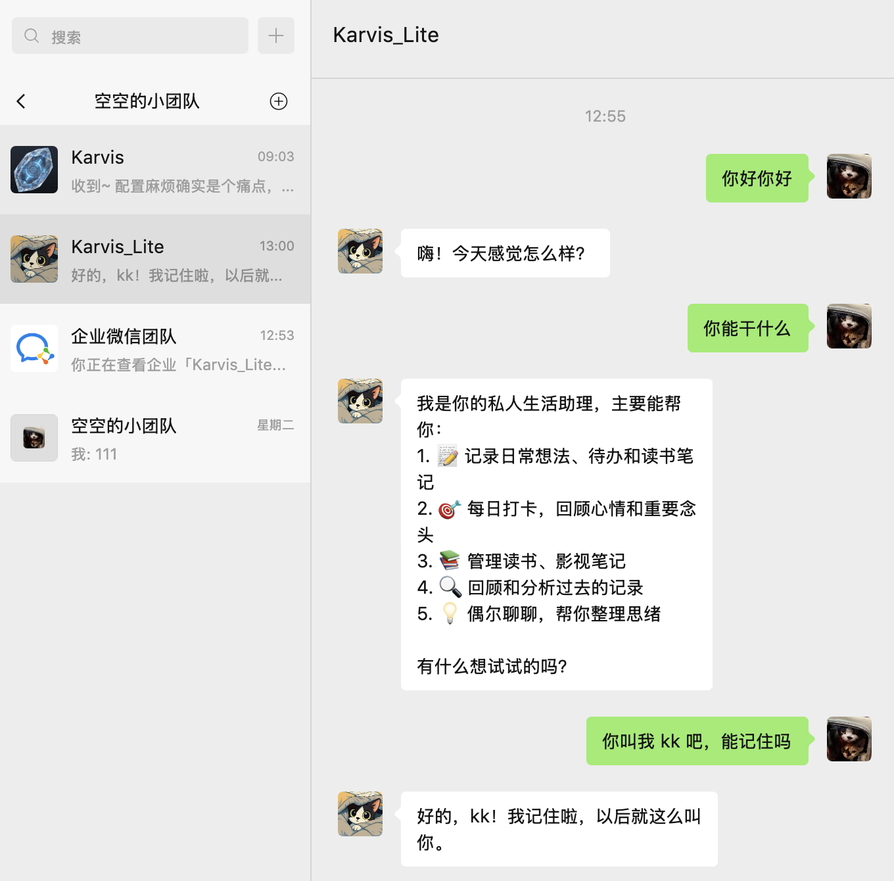
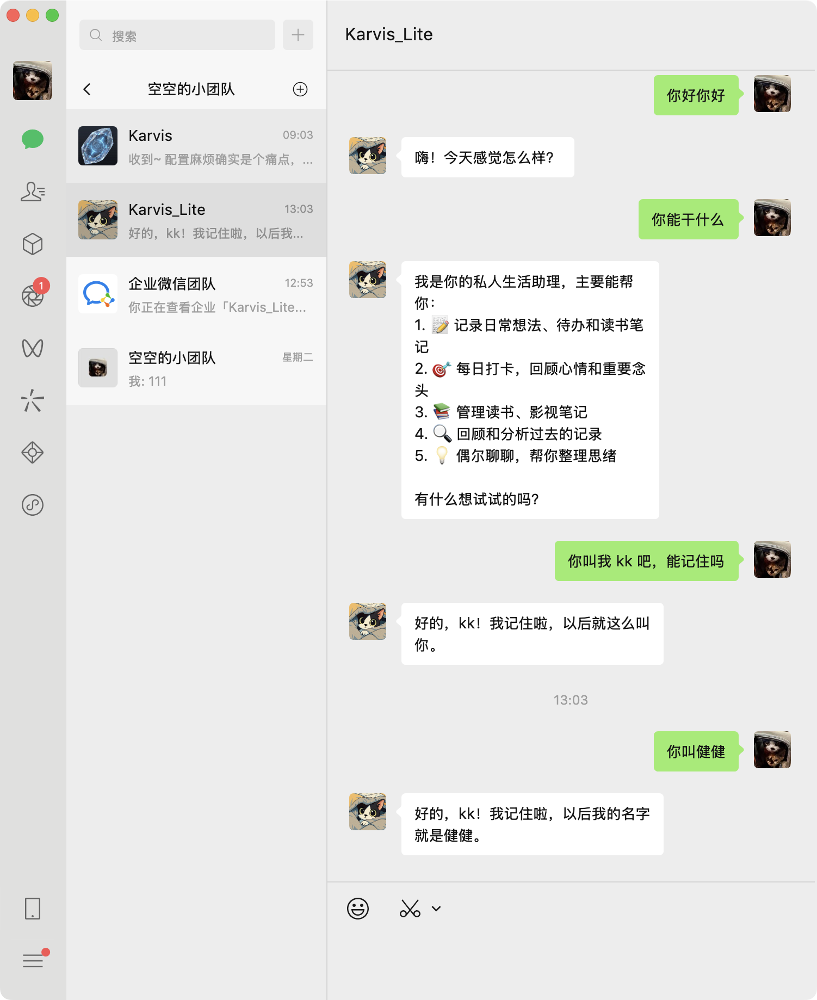
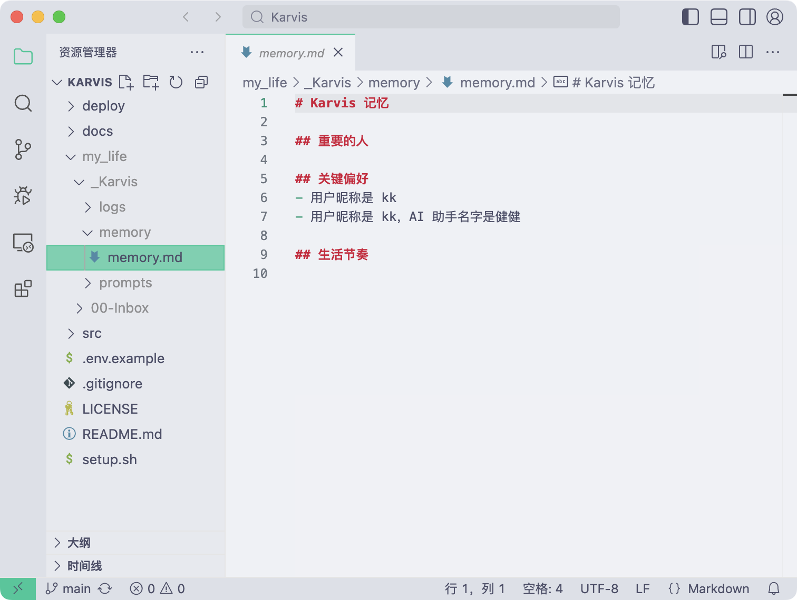

# Karvis

运行在企业微信上的个人 AI 生活助手。

给 Karvis 发消息，它帮你记录生活、管理待办、每日复盘、情绪追踪、周报月报——所有数据都存在你自己手里。

<p align="center">
  
  &nbsp;&nbsp;
  
  &nbsp;&nbsp;
  
</p>

---

## 功能一览

### 📝 日常记录
- **全类型消息存档**：文字、语音、图片、视频、链接 → 自动存到 Quick-Notes
- **智能分类归档**：自动归类到工作笔记 / 情感日记 / 生活趣事 / 碎碎念
- **链接解析**：分享链接自动抓取全文，回复基于内容理解
- **语音日记**：长语音（>30秒）自动整理为结构化日记（主题/情绪/关键事件/洞察）
- **读书笔记**：书摘、感想、AI 总结、金句提炼
- **影视笔记**：影评、感想、自动填充影视信息

### ✅ 待办与习惯
- **待办管理**：自然语言增删查，支持截止日期和定时提醒，序号批量操作
- **每日 Top 3**：早报引导设定当天 3 件重要事，晚间追踪完成情况
- **微习惯实验**：基于行为模式自动提议微习惯，触发词检测，实验周期跟踪
- **决策复盘**：记录重要决策，N 天后自动提醒复盘结果

### 📊 复盘与洞察
- **每日打卡**：4 个问题引导复盘，写入日记
- **情绪日记**：每天自动从消息中提取情绪脉络，生成分析
- **日报**：当日总结、情绪评分、亮点洞察
- **周报**：碎片连线、情绪曲线、数据统计、关联发现
- **月报**：成长轨迹、高光低谷、人际变化、深度洞察
- **主题深潜**：跨时间线搜索全历史，生成深度分析报告

### 🤝 主动陪伴
- **智能关怀**：有事才发，没事不发（五层防骚扰）
- **沉默检测**：长时间没消息时温柔问候
- **情绪跟进**：前一天情绪低落时次日关心
- **待办轻推**：午间提醒未完成事项
- **时间胶囊**：早报中回顾 7天/30天/365天 前的记录

---

## 核心架构

```
企业微信 → /wework (Flask, 解密/去重/ASR)
    ↓ 异步转发
/process → brain.process()
    ├── 加载 State + Memory（三级缓存）
    ├── 三层模型路由 → JSON 决策
    │   ├── Flash (Qwen)       — 陪伴关怀、轻量生成
    │   ├── Main  (DeepSeek)   — 日常路由、Skill 分发
    │   └── Think (DeepSeek R1) — 深度分析、主题深潜
    ├── V4 Flash 智能回复 → Qwen 二次生成自然语言
    ├── Agent Loop（最多 5 轮）→ 文件搜索/读取后再回答
    ├── Skill 分发 → 执行操作 → 写回数据
    └── Memory 更新 + 决策日志

/system → 内置定时调度器（APScheduler，本地自动运行）
    ├── 缓存刷新              （每 30 分钟）
    ├── 晨报                  （每天 08:00）
    ├── 待办提醒              （每天 09:00/14:00/18:00）
    ├── 轻推检测              （每天 14:00）
    ├── 主动陪伴检查          （08-22 点每 2 小时）
    ├── 晚间签到              （每天 21:00）
    ├── 周回顾                （每周日 21:30）
    ├── 情绪日记              （每天 22:00）
    ├── 日报生成              （每天 22:30）
    └── 月度成长回顾          （每月末 22:00）
```

### 三层模型路由

| 层级 | 模型 | 用途 | 特点 |
|---|---|---|---|
| **Flash** | Qwen Flash | 陪伴消息、Flash 智能回复 | 快速、低成本 |
| **Main** | DeepSeek V3 | 日常路由、Skill 分发、日报/周报/月报 | 平衡性能与质量 |
| **Think** | DeepSeek R1 | 主题深潜、决策分析 | 深度推理，thinking 模式 |

自动降级：Flash 失败 → 降级到 Main；Main 失败 → 返回错误提示。

### V4 Flash 智能回复

Skill 执行完成后，Brain 不直接拼接回复，而是把操作结果交给 Qwen Flash 二次生成自然语言回复：
- 操作成功 → 自然语言确认，不机械列出技术细节
- 数据展示 → 按用户意图组织格式
- 操作失败 → 友好告知并建议

### Agent Loop（对话式任务）

当用户问题需要查阅笔记时，Brain 进入多轮 Agent Loop（最多 5 轮）：

1. 用户问"我之前写过什么关于 xxx 的" → Brain 判断需要搜索
2. 调用 `internal.search` 搜索关键词 → 返回结果 → `continue: true`
3. 可能再调用 `internal.read` 读取具体文件 → 返回内容 → `continue: true`
4. 信息足够后 → `continue: false` + 基于搜集到的信息回答用户

---

## 完整 Skill 列表

Karvis 共 31 个 Skill 命令，分布在 15 个功能模块中。Brain 根据用户消息自动选择：

| 分类 | Skill | 说明 |
|---|---|---|
| **笔记** | `note.save` | 保存到 Quick-Notes |
| | `classify.archive` | 智能归档（work/emotion/fun/misc） |
| **打卡** | `checkin.start` | 启动每日打卡 |
| | `checkin.answer` | 回答打卡问题 |
| | `checkin.skip` | 跳过打卡题 |
| | `checkin.cancel` | 取消打卡 |
| **待办** | `todo.add` | 添加待办（支持 due_date/remind_at） |
| | `todo.done` | 完成待办（keyword 模糊匹配 / indices 序号） |
| | `todo.list` | 查看待办列表 |
| **读书** | `book.create` | 创建/切换读书笔记 |
| | `book.excerpt` | 添加书摘 |
| | `book.thought` | 添加读书感想 |
| | `book.summary` | AI 生成读书总结 |
| | `book.quotes` | AI 提炼金句 |
| **影视** | `media.create` | 创建影视笔记 |
| | `media.thought` | 添加影视感想 |
| **复盘** | `daily.generate` | 生成日报 |
| | `mood.generate` | 生成情绪日记 |
| | `weekly.review` | 生成周回顾 |
| | `deep.dive` | 主题深潜 |
| **习惯** | `habit.propose` | 提议新微习惯实验 |
| | `habit.nudge` | 实验触发提醒 |
| | `habit.status` | 查看实验进度 |
| | `habit.complete` | 结束实验并总结 |
| **决策** | `decision.record` | 记录重要决策 |
| | `decision.review` | 决策复盘 |
| | `decision.list` | 查看待复盘的决策 |
| **语音** | `voice.journal` | 长语音整理为结构化日记 |
| **Agent** | `internal.read` | 读取指定文件 |
| | `internal.search` | 搜索笔记关键词 |
| | `internal.list` | 列出目录文件 |
| **其他** | `ignore` | 不执行操作（闲聊回复） |

> 新增 Skill 只需在 `src/skills/` 下创建文件并声明 `SKILL_REGISTRY`，`skill_loader` 自动发现，无需改 `brain.py`。

---

## 快速开始（10 分钟）

### Step 0：准备两样东西

**① DeepSeek API Key**（2 分钟）

1. 前往 [DeepSeek 开放平台](https://platform.deepseek.com/) 注册（或 [腾讯云知识引擎 lkeap](https://console.cloud.tencent.com/lkeap)）
2. 创建 API Key，复制保存
3. 充值（日常约 0.5-2 元/天）

**② 企业微信自建应用**（5 分钟）

1. 前往 [企业微信管理后台](https://work.weixin.qq.com/) 注册（个人可注册，选「个人」类型，微信扫码即可）
2. 记下你的 **企业 ID**（Corp ID）：「我的企业」页面底部
3. 创建自建应用：管理后台 → 应用管理 → 自建 → 创建应用
4. 记下应用的 **AgentId**（详情页顶部）和 **Secret**（详情页 → 查看）
5. 配置「接收消息」：应用详情 → 接收消息 → 设置 API 接收
   - URL 先空着（等拿到公网地址再填）
   - **Token** 和 **EncodingAESKey**：点随机生成，**复制保存好**
6. 配置「企业可信IP」：应用详情页 → 企业可信IP → 填入你的**公网 IP**
   - 终端运行 `curl ifconfig.me` 获取
   - 换了网络环境需更新此 IP

> 到这里你应该有 6 个值：DeepSeek API Key、企业 ID、Agent ID、Secret、Token、EncodingAESKey

### Step 1：一键安装

```bash
git clone https://github.com/sameencai/Karvis.git
cd Karvis
chmod +x setup.sh
./setup.sh
```

脚本会引导你完成：
- ✅ 检查 Python 环境
- ✅ 安装依赖
- ✅ 交互式填写配置（把 Step 0 准备好的值粘贴进去）
- ✅ 自动安装内网穿透工具 (cloudflared)
- ✅ 启动 Karvis + 生成公网 URL

> OneDrive 相关配置直接回车跳过，先用 Lite 模式体验。

### Step 2：配置企微回调

脚本启动成功后会显示一个公网 URL，类似：

```
https://example-words-here.trycloudflare.com
```

回到企微管理后台 → 你的应用 → 接收消息 → API 接收：
- **URL** 填：`https://你的公网地址/wework`（注意末尾加 `/wework`）
- Token 和 EncodingAESKey 就是 Step 0 中生成的
- 点击保存

### Step 3：发条消息试试！

打开企业微信 → 找到你创建的 Karvis 应用 → 发一条消息，比如「你好」。

如果一切正常，Karvis 会回复你 🎉

---

## 你的数据在哪里

Lite 模式下，所有数据都保存在项目根目录的 **`my_life/`** 文件夹：

```
my_life/
├── 00-Inbox/
│   ├── Quick-Notes.md          ← 你发的所有消息（原始记录）
│   ├── Todo.md                 ← 待办事项
│   └── .ai-life-state.json    ← AI 状态（打卡进度、情绪评分等）
├── 01-Daily/                   ← 日记、周报、月报
├── 02-Notes/                   ← 归档笔记
│   ├── 读书笔记/
│   ├── 影视笔记/
│   ├── 情感日记/
│   ├── 工作笔记/
│   ├── 生活趣事/
│   └── 语音日记/
└── _Karvis/
    ├── memory/
    │   └── memory.md           ← AI 的长期记忆（用户画像、偏好、重要的人）
    └── logs/
        └── decisions.jsonl     ← 决策日志
```

> **关于 AI 人设**：SOUL（性格）、SKILLS（技能列表）、RULES（决策规则）已统一管理在 `src/prompts.py` 中。修改 `prompts.py` 即可自定义 AI 行为。
>
> 想同步到 Obsidian？配置 OneDrive 即可无缝切换，数据结构完全一致。

---

## 两种运行模式

| 模式 | 数据存储 | 需要配置 | 适合 |
|---|---|---|---|
| **Lite 模式**（默认） | 本地 `my_life/` | DeepSeek Key + 企微 | 快速体验 |
| **完整模式** | OneDrive → Obsidian | 上面 + Azure AD + OneDrive | 数据永久同步到 Obsidian |

> **Lite 模式说明**：不配置 OneDrive 时自动启用。内置定时调度器自动运行，无需额外部署。
> 电脑需保持开机和网络连接。想 24/7 运行？参考下方「部署到腾讯云 SCF」。

---

## 其他安装方式

<details>
<summary>Docker 部署</summary>

```bash
git clone https://github.com/sameencai/Karvis.git
cd Karvis
cp .env.example src/.env
# 编辑 src/.env，填入 Step 0 准备好的配置
cd deploy
docker-compose up -d
```

Docker 启动后需自行配置内网穿透。

</details>

<details>
<summary>手动安装</summary>

```bash
git clone https://github.com/sameencai/Karvis.git
cd Karvis/src
pip install -r requirements.txt
cp ../.env.example .env
# 编辑 .env，填入 Step 0 准备好的配置
python app.py
```

手动启动后运行内网穿透：

```bash
cloudflared tunnel --url http://localhost:9000
```

</details>

---

## 进阶配置

> 以下内容面向想使用完整功能的用户。只是体验 Lite 模式的话，上面就够了。

### 部署到腾讯云 SCF（生产环境）

本地运行适合体验，生产使用建议部署到腾讯云 SCF（免费额度足够个人使用）：

1. 在 [腾讯云 SCF 控制台](https://console.cloud.tencent.com/scf) 创建 **Web 函数**（Python 3.9，256MB 内存，180s 超时）
2. 上传 `src/` 目录下所有文件
3. 在函数配置 → 环境变量中填入 `.env` 中的所有变量
4. 部署后获得公网 URL，填入 `PROCESS_ENDPOINT_URL` 环境变量
5. 配置企微回调 URL 指向 SCF 的 `/wework` 路径
6. 另外创建 **Event 函数**（上传 `deploy/scheduler/` 目录），配置定时触发器

### 企业微信详细配置

<details>
<summary>展开查看</summary>

**第一步：注册企业微信**

1. 前往 [企业微信管理后台](https://work.weixin.qq.com/) 注册
2. 个人也可注册——选「个人」类型，微信扫码即可
3. 记下 **企业 ID**（Corp ID）：「我的企业」页面底部

**第二步：创建自建应用**

1. 管理后台 → 应用管理 → 自建 → 创建应用
2. 填写应用名称（如 "Karvis"），上传 logo，选择可见范围
3. 记下 **AgentId**（详情页顶部）和 **Secret**（详情页 → 查看）

**第三步：配置消息接收**

1. 应用详情页 → 接收消息 → 设置 API 接收
2. 填入公网 URL + `/wework`
3. 自定义 **Token** 和 **EncodingAESKey**（点随机生成）
4. 保存后企微会发验证请求，Karvis 会自动通过

**对应的环境变量：**

```bash
WEWORK_CORP_ID=ww1234567890abcdef     # 企业 ID
WEWORK_AGENT_ID=1000003                # 应用 AgentId
WEWORK_CORP_SECRET=your-app-secret     # 应用 Secret
WEWORK_TOKEN=your-callback-token       # 接收消息的 Token
WEWORK_ENCODING_AES_KEY=your-aes-key   # 接收消息的 EncodingAESKey
```

</details>

### OneDrive 配置（Obsidian 同步）

<details>
<summary>展开查看</summary>

Karvis 通过 Microsoft Graph API 读写 OneDrive 上的 Obsidian Vault。

**注册 Azure 应用**

1. 前往 [Azure App 注册](https://portal.azure.com/#view/Microsoft_AAD_RegisteredApps/ApplicationsListBlade)
2. 新注册 → 名称如 "Karvis OneDrive"
3. 账户类型：「任何组织目录中的帐户和个人 Microsoft 帐户」
4. 重定向 URI：`https://login.microsoftonline.com/common/oauth2/nativeclient`
5. 记下 **Application (client) ID**

**配置 API 权限**

1. API 权限 → 添加权限 → Microsoft Graph → 委托的权限
2. 添加：`Files.ReadWrite`、`offline_access`

**获取 Refresh Token**

1. 浏览器打开（替换 `{CLIENT_ID}`）：
   ```
   https://login.microsoftonline.com/common/oauth2/v2.0/authorize?client_id={CLIENT_ID}&response_type=code&redirect_uri=https://login.microsoftonline.com/common/oauth2/nativeclient&scope=Files.ReadWrite%20offline_access
   ```
2. 登录授权后，浏览器跳转到带 `code=xxx` 的 URL，复制 code
3. 换取 refresh_token：
   ```bash
   curl -X POST https://login.microsoftonline.com/common/oauth2/v2.0/token \
     -d "client_id={CLIENT_ID}" \
     -d "code={AUTH_CODE}" \
     -d "redirect_uri=https://login.microsoftonline.com/common/oauth2/nativeclient" \
     -d "grant_type=authorization_code" \
     -d "scope=Files.ReadWrite offline_access"
   ```

**配置 Client Secret**

1. 证书和密码 → 新客户端密码 → 添加
2. 记下密码值

```bash
ONEDRIVE_CLIENT_ID=your-client-id
ONEDRIVE_CLIENT_SECRET=your-secret
ONEDRIVE_REFRESH_TOKEN=your-refresh-token
OBSIDIAN_BASE=/应用/remotely-save/YourVault
```

</details>

### 可选服务

<details>
<summary>阿里云百炼 Qwen（Flash 智能回复 + 主动陪伴）</summary>

```bash
QWEN_API_KEY=sk-xxxxxxxx
QWEN_BASE_URL=https://dashscope.aliyuncs.com/compatible-mode/v1
QWEN_MODEL=qwen-plus-latest
```

不配则 Flash 层降级到 DeepSeek，主动陪伴仍可用。任何兼容 OpenAI API 的模型都可替代。

</details>

<details>
<summary>腾讯云 ASR（语音识别）</summary>

```bash
TENCENT_APPID=1234567890
TENCENT_SECRET_ID=AKIDxxxxxxxx
TENCENT_SECRET_KEY=xxxxxxxx
```

不配则语音功能不可用。每月 10 小时免费。

</details>

<details>
<summary>心知天气（晨报天气）</summary>

```bash
SENIVERSE_KEY=your-api-key
WEATHER_CITY=深圳
```

不配则晨报跳过天气信息。

</details>

---

## 项目结构

```
Karvis/
├── README.md
├── LICENSE
├── setup.sh                 # 一键安装脚本
├── .env.example             # 配置模板
│
├── src/                     # 源码
│   ├── app.py               # Flask 网关（消息接收/解密/ASR/异步转发/定时调度）
│   ├── brain.py             # 核心大脑（Prompt 组装 → 多模型路由 → JSON 解析 → Skill 分发 → 记忆更新）
│   ├── prompts.py           # Prompt 统一管理（SOUL/SKILLS/RULES/所有模板）
│   ├── memory.py            # 记忆管理（长期记忆/短期记忆/State 缓存）
│   ├── config.py            # 统一配置（环境变量/路径/参数）
│   ├── storage.py           # 存储抽象层（自动选择 OneDrive / 本地）
│   ├── local_io.py          # 本地文件存储
│   ├── onedrive_io.py       # OneDrive 存储（Microsoft Graph API）
│   ├── wework_crypto.py     # 企微消息加解密
│   ├── skill_loader.py      # Skill 自动发现与加载
│   ├── prompts_example/     # Prompt 模板（首次启动时参考）
│   └── skills/              # 技能模块（15 个）
│       ├── note_save.py         # 笔记保存
│       ├── classify_archive.py  # 智能归档
│       ├── checkin_flow.py      # 打卡流程
│       ├── todo_manage.py       # 待办管理
│       ├── book_notes.py        # 读书笔记
│       ├── media_notes.py       # 影视笔记
│       ├── daily_report.py      # 日报生成
│       ├── mood_diary.py        # 情绪日记
│       ├── weekly_review.py     # 周回顾
│       ├── monthly_review.py    # 月度成长回顾
│       ├── voice_journal.py     # 语音日记
│       ├── deep_dive.py         # 主题深潜
│       ├── habit_coach.py       # 微习惯实验
│       ├── decision_track.py    # 决策复盘
│       └── internal_ops.py      # Agent Loop 文件操作
│
├── my_life/                 # 你的数字生活（自动生成，.gitignore）
│   ├── 00-Inbox/
│   ├── 01-Daily/
│   ├── 02-Notes/
│   └── _Karvis/
│
├── deploy/                  # 部署文件
│   ├── Dockerfile
│   ├── docker-compose.yml
│   ├── scf_bootstrap
│   └── scheduler/           # SCF 定时调度器
│
├── docs/                    # 开发者文档
└── assets/                  # 截图等资源
    └── screenshots/
```

---

## 自定义 AI 人设

Karvis 的所有 Prompt 统一管理在 `src/prompts.py` 中：

- **SOUL** — AI 的性格（称呼、语气、态度、时间感知）
- **SKILLS** — 可用技能列表及参数格式
- **RULES** — 决策规则（什么消息触发什么技能）
- **OUTPUT_FORMAT** — LLM 输出 JSON 格式规范
- **FLASH_REPLY** — V4 Flash 智能回复指令
- **COMPANION_TASK** — 主动陪伴消息生成指令
- 各类模板：DAILY / MOOD / WEEKLY / MONTHLY / VOICE / DEEP_DIVE / BOOK 等

> 改 Prompt 就能改变 80% 的行为，不需要改代码。

---

## 新增 Skill

1. 在 `src/skills/` 下创建 `your_skill.py`
2. 实现 `execute(params, state)` 函数
3. 末尾声明 `SKILL_REGISTRY = {"your.skill": handler_fn}`
4. 在 `src/prompts.py` 的 `SKILLS` 和 `RULES` 中添加对应说明
5. 重启 Karvis 即可

无需修改 `brain.py`，`skill_loader` 会自动发现新模块。

---

## License

[MIT](LICENSE)
